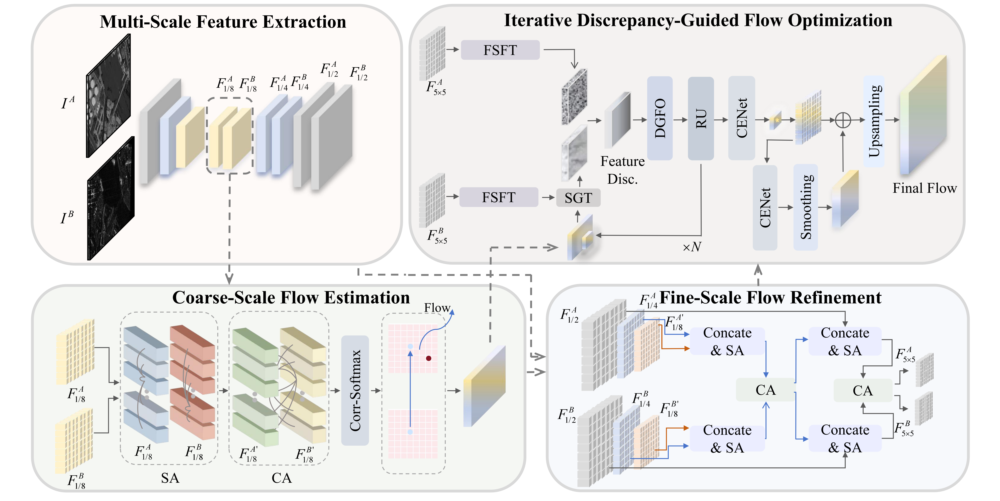

# CRFT (CVPR 2026)
### [Project Page](https://github.com/NEU-Liuxuecong/CRFT) 
Official implementation of **CRFT: Consistent-Recurrent Feature Flow Transformer for Cross-Modal Image Registration**.

## Links
- **Code**: [GitHub Repository](https://github.com/NEU-Liuxuecong/CRFT)
- **Paper**: [arXiv](https://arxiv.org/abs/2604.05689)
- **Pretrained Weights**: [Release](https://github.com/NEU-Liuxuecong/CRFT/releases)

## Authors
**Xuecong Liu, Mengzhu Ding, Zixuan Sun, Zhang Li, Xichao Teng**


## Overview



## Data Preparation
To evaluate/train CRFT, you will need to download the required datasets. 
* [RoadScene](https://pan.baidu.com/s/1zTTnmMTmh_q_6EUBveAa0Q?pwd=9n19  password: 9n19)
* [OSdataset](https://pan.baidu.com/s/12DeWPjZdaP3aX4Gbt5n9Cw?pwd=9n19  password: 9n19)


You can create symbolic links to wherever the datasets were downloaded in the `datasets` folder

```Shell
├── datasets
    ├── os_dataset
        ├── train
           ├── image_pair
           ├── truth_flow
           ├── datum
        ├── test
           ├── image_pair
           ├── truth_flow
           ├── datum
        ├── val
           ├── image_pair
           ├── truth_flow
           ├── datum
     ├── RoadScene
        ├── train
           ├── image_pair
           ├── truth_flow
           ├── datum
        ├── test
           ├── image_pair
           ├── truth_flow
           ├── datum
        ├── val
           ├── image_pair
           ├── truth_flow
           ├── datum
```

## Requirements
```shell
conda create --name crft python=3.9.7
conda activate crft
conda install pytorch=2.3.1 torchvision=0.18.1 pytorch-cuda=12.1 matplotlib tensorboard scipy opencv -c pytorch -c nvidia
pip install opencv-python==4.8.0.76
pip install numpy==1.26.4
pip install pytorch-lightning loguru joblib tqdm h5py einops
```

## Training
```shell
python train.py
```

## Models
We provide models trained on OSdataset and RoadScene respectively. The default path of the models for evaluation is:
```Shell
├── checkpoints
    ├── CRFT_OSdataset.ckpt
    ├── CRFT_RoadScene.ckpt 
```


## Test
```Shell
python test.py 
```


## Citation
```bibtex

```
